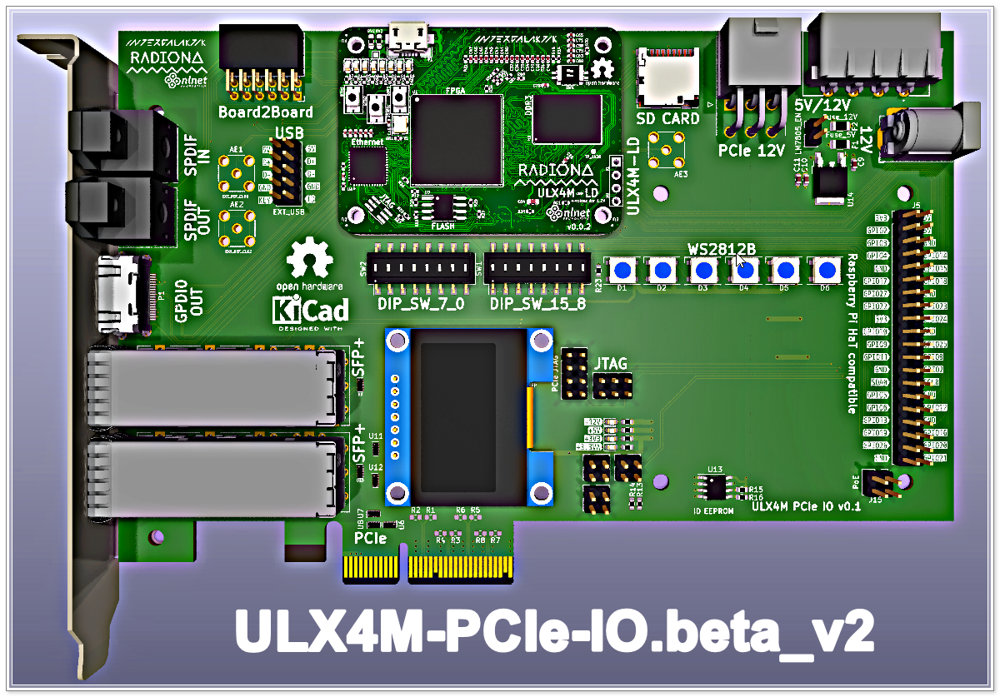

# PCB Description

This is work area for the PCB-related thoughts and explanations, including the steps and results for conducting high-speed [openEMS](https://docs.openems.de) simulations.

#### References:
- [USB3 PHY for GateMate](https://nlnet.nl/project/GateMate-USB3-PHY)
- [KiCad and openEMS](https://www.youtube.com/watch?v=VcJqhsbzR3c)

Just for illustration and to get the ball rolling, here is an earlier attemp at PCIE "Slot" EndPoint card. Stay tuned for more...

  

--------------------
#### End of Document
