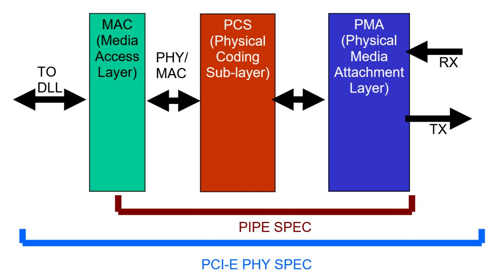

# PIPE PHY

This is work area for the CologneChip PHY PIPE developers.

  

## PIPE Interface Recap
#### Signal Composition
#### Data Flow
#### Control Flow

#### References:

- [CologneChip PHY/PIPE Overview](0.doc/PIPE_overview.pdf)
- [Unified PIPE Spec, Sept.2025, v7.1](0.doc/Intel.643108_PIPE_Arch_Spec_Rev_7_1.pdf)
- [TUSB1310A USB SuperSpeed PHY with PIPE](https://www.ti.com/product/TUSB1310A)
- [Mithro on SerDes](https://docs.google.com/presentation/d/e/2PACX-1vSgIGVCZtNt8RdifZXOLOJDDCj7g05zxr9WS2NjmQtM_E0GfZKCBYhASCto4eURL-86uNwJaXfo1qMC/pub?start=false&loop=false&delayms=3000#slide=id.g151286a907e_0_230)

--------------------
#### End of Document
