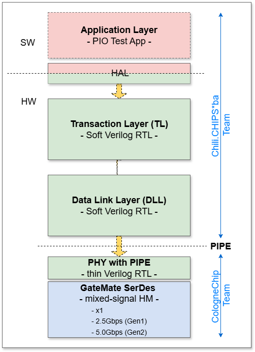

# RTL Architecture (WIP)

#### References:
- [liteFury PCIE EP](https://github.com/hdlguy/litefury_pcie)
- [Wavelet-lab PCIE EP](https://github.com/wavelet-lab/usdr-fpga/tree/main/lib/pci)
- [LitePCIE EP](https://github.com/enjoy-digital/litepcie)
- [ECP5-PCIE EP](https://github.com/ECP5-PCIe/ECP5-PCIe)
- [Yumewatari](https://github.com/whitequark/Yumewatari)
- [Alex's PCIE EP](https://github.com/alexforencich/verilog-pcie)
- [Alex's PCIE cocoTB](https://github.com/alexforencich/cocotbext-pcie)
- [Regymm's PCIE_7x EP](https://github.com/regymm/pcie_7x)
- [PCIE EP DMA - Wupper](https://gitlab.nikhef.nl/franss/wupper)
- [Warp-pipe: PCIe network simulator](https://github.com/antmicro/warp-pipe)

<ins>Note:</ins> _"opensource"_ PCIE EP designs in the above references are not truly opensource. They all rely on the vendor-proprietary **PCIE HM**, which is a black box that provides _Transport Layer_ (TL) and _Data Link Layer_ (DLL) protocol stack. The HM insides are invisible and inaccessible, and also not portable to other FPGA families. We intend to fully replace these vendor-locked PCIE HMs with soft, unencrypted, free to use, free to modify and inspect, clean and very readable System Verilog RTL.

------
At the moment, this section is merely a scratchpad of our thoughts and ideas, team comments and suggestions..., from which we seek to define the structure, interfaces, partitioning. 

**This is also an open, community-wide invite to jump on the train and contribute to this creation process...**

  

## Credit-based Flow Control
Simon:
> Just to add to the knowledge base, the PCIe flow control credit based system updates with ever increasing numbers (modulo n) to indicate the number of credits issued since initialisation, rather than advertising the current available space. The credits available to an uplink (for a given type) is the difference (unsigned) between the count of credits consumed since initialisation and the last updated value via an UpdateFC DLL transaction. Rollover is handled by only allowing up to half the maximum count of available credits. E.g, for data credits with 12 bits = 4096, only a max of 2048 advertised available credits is allowed. If an update has a value, say of 2, whilst the consumed credit count is, say, 4094, then 2- 4094, using unsigned arithmetic modulo 2^12 equals 4, as expected. The diagram implies the use of an up/down counter, which could work but more arithmetic logic would be needed and the corner case of requiring to handle both adding and subtracting in the same cycle to the credit count.
Also a straight FIFO can't be used. The DLL needs a retry buffer where data is held until it has been acknowledged as it may need resending if NAK'd. Thus pointers in the queue need to be able to rewind to the start of packets, which are only deleted once properly ACK'd, though multiple packets can be ACK'd at once (based on the packet sequence numbers).
>
> TX and RX data interfaces are required to send and receive packets, with some sort of delimiting such as a 'last' signal and/or 'start'. ACK and NAK DLLP generation I would think would be internal, but some status output if NAK'd too often. Flow control DLLP generation would also, I think, be internal, though any generics to set the size of the retry buffers would reflect in the InitFC<n>-XXX DLLPs during DLL initialisation, so these need to be available to the logic. I assume only a single virtual channel (VC0) is to be implemented. A control signal to start DLL initialisation (on, say, a 'Link_UP' transition from the PHY) and a status output to reflect DLL_down/DLL_up state).
>
> Some additional error status signals, beyond NAK error, may be required to flag things such as buffer over- or underrun (which shouldn't happen in normal circumstances), but will be design specific and dictated by the implementation.

## Link Training
Simon: 
> I don't see where in the diagram a configuration space is located unless it's part of the transaction layer or maybe there's supposed to be an interface defined for external, peripheral specific implementation? Also, I don't see where generation and detection of PHY ordered sets is done---from the blurb in the top level README.md, I assume not the thin layer RTL PHY with PIPE. If so, that suggests a partial PHY layer between the DLL layer and the thin PHY PIPE layer, that implements the LTSSM to generated training sequences and count received training sequences of the different types, and a means to regularly generate skip ordered sets (unless in the thin PHY?). I am aware that the top level README.md says _"We only support x1 (single-lane) PCIE links. The link width training is therefore omitted"_, but whatever you connect to will be in the link down state and will need training to get to the link up state. Link training is not only to set the link width and it is not optional, even for an x1 link.

## Power Management DLLPs
Simon:
> From the top level README.md it seems that power management isn't to be initially supported, but some hooks to detect reception of, and to generate, power management DLLPs might be good, so some control and status signals for this might be added, even if not used initially. The only other packet not covered is the Vendor specific DLLP, which is optional and has no requirement to support, except, possibly, to receive and discard---but no external interface requirements.

## TL_IF
#### Signal Composition
#### Data Flow
#### Control Flow

## DLL_IF
#### Signal Composition
#### Data Flow
#### Control Flow

## PIPE
See [2.rtl.PHY](../2.rtl.PHY/README.md)

## 'soc_if' and TL2PIO Bridge
Add brief description of how the RTL part of TestApp interacts with the PCIE Core.

--------------------
#### End of Document
