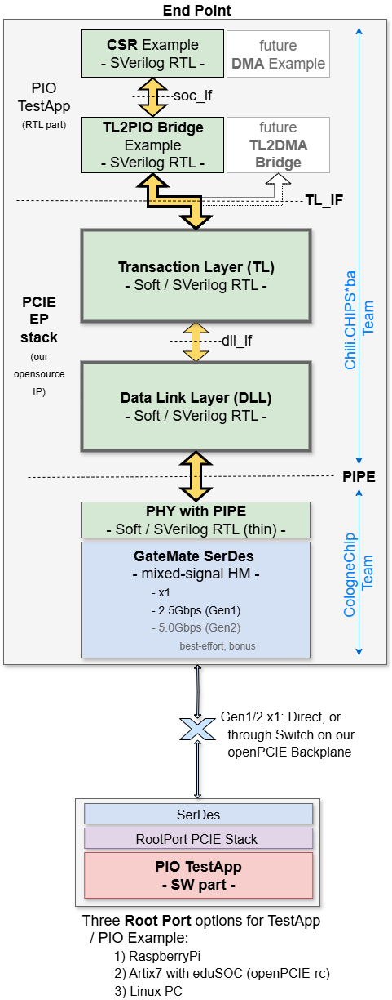

# RTL Architecture

**[WIP]**

At the moment, this section is merely a scratchpad of our thoughts and ideas, team comments and suggestions..., from which we seek to define the structure, interfaces, partitioning. 

**This is also an open, community-wide invite to jump on the train and contribute to this creation process...**

  

Simon: 
> I don't see where in the diagram a configuration space is located unless it's part of the transaction layer or maybe there's supposed to be an interface defined for external, peripheral specific implementation? Also, I don't see where generation and detection of PHY ordered sets is done---from the blurb in the top level README.md, I assume not the thin layer RTL PHY with PIPE. If so, that suggests a partial PHY layer between the DLL layer and the thin PHY PIPE layer, that implements the LTSSM to generated training sequences and count received training sequences of the different types, and a means to regularly generate skip ordered sets (unless in the thin PHY?). I am aware that the top level README.md says _"We only support x1 (single-lane) PCIE links. The link width training is therefore omitted"_, but whatever you connect to will be in the link down state and will need training to get to the link up state. Link training is not only to set the link width and it is not optional, even for an x1 link.
>
> TX and RX data interfaces are required to send and receive packets, with some sort of delimiting such as a 'last' signal and/or 'start'. ACK and NAK DLLP generation I would think would be internal, but some status output if NAK'd too often. Flow control DLLP generation would also, I think, be internal, though any generics to set the size of the retry buffers would reflect in the InitFC<n>-XXX DLLPs during DLL initialisation, so these need to be available to the logic. I assume only a single virtual channel (VC0) is to be implemented. A control signal to start DLL initialisation (on, say, a 'Link_UP' transition from the PHY) and a status output to reflect DLL_down/DLL_up state).
>
> Some additional error status signals, beyond NAK error, may be required to flag things such as buffer over- or underrun (which shouldn't happen in normal circumstances), but will be design specific and dictated by the implementation.
>
> From the top level README.md it seems that power management isn't to be initially supported, but some hooks to detect reception of, and to generate, power management DLLPs might be good, so some control and status signals for this might be added, even if not used initially. The only other packet not covered is the Vendor specific DLLP, which is optional and has no requirement to support, except, possibly, to receive and discard---but no external interface requirements.

## 1) TL_IF
#### Signal Composition
#### Data Flow
#### Control Flow

## 2) DLL_IF
#### Signal Composition
#### Data Flow
#### Control Flow

## 3) PIPE
See [2.rtl.PHY](../2.rtl.PHY/README.md)

## 4) 'soc_if' and TL2PIO Bridge
Add brief description of how the RTL part of TestApp interacts with the PCIE Core.

--------------------
#### End of Document
