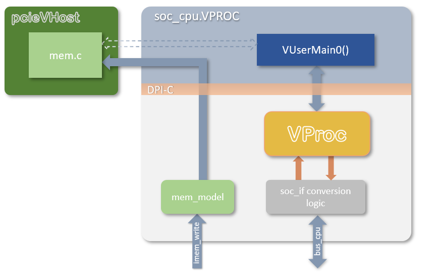

# Simulation Models

This directory contains the following bus functional model

* `soc_cpu.VPROC.sv` : _VProc_ based `soc_cpu` compatible virtual processor.

In addition, sub-directories contain the following models

* [`cosim`](cosim/README.md) : Contains the _VProc_ and _mem_model_ co-simulation VIP.
* [`rv32`](rv32/README.md) : Contains the _rv32_ RISC-V RV32GCC_Zbb instruction set simulator C++ model
* [`pcievhost`](pcievhost/README.md) : Contains the PCIe traffic generator with PIPE TX and RX adta interface for a single lane.

## soc_cpu.VPROC

The `soc_cpu.VPROC` module is pin compatible with the other `soc_cpu` components with RTL softcore implementations of 32-bit RISC-V processors, such as that based on PicoRV32 or EDUBOS5. In place of the softcore is a [_VProc_](https://github.com/wyvernSemi/vproc) virtual processor which can run natively compiled code and drive its memory mapped bus in the logic simulation (see [here](../README.md#vproc-software)). The HDL has only two interfaces. The main memory mapped bus is of type `soc_if`, and this is the external bus to the rest of the logic, just as for the softcores. The other interface is a three wire write-only port (`imem_we`, `imem_waddr[31:2]` and `imem_wdat[31:0]`) for updating the processor program via an external UART. In the `soc_cpu.VPROC` component this is connected to an instantiation of the [_mem_model_](https://github.com/wyvernSemi/mem_model) memory HDL, used by _VProc_ for its [main memory](../README.md#the-mem_model-co-simulation-sparse-memory-model), which accesses the sparse C memory model of [_pcieVHost_](https://github.com/wyvernSemi/pcievhost), allowing this upload to go to the same memory as accessible by the virtual processor.

## Others

TODO