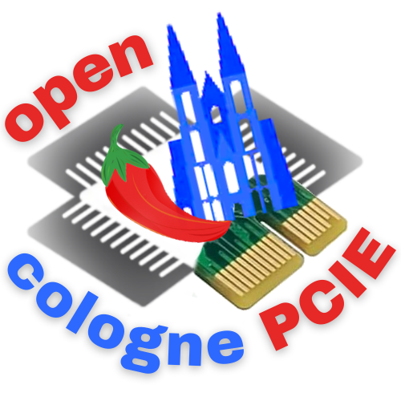
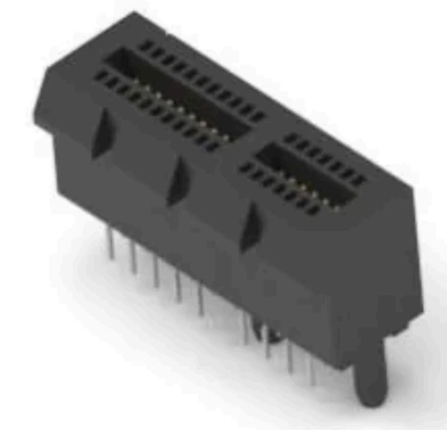
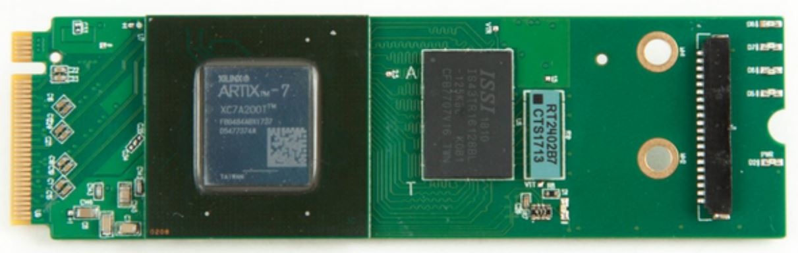
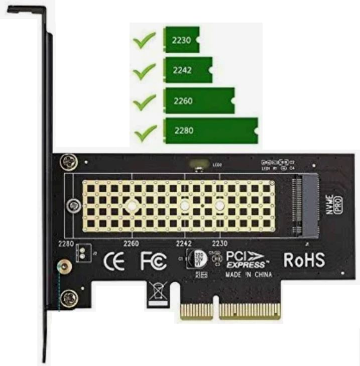
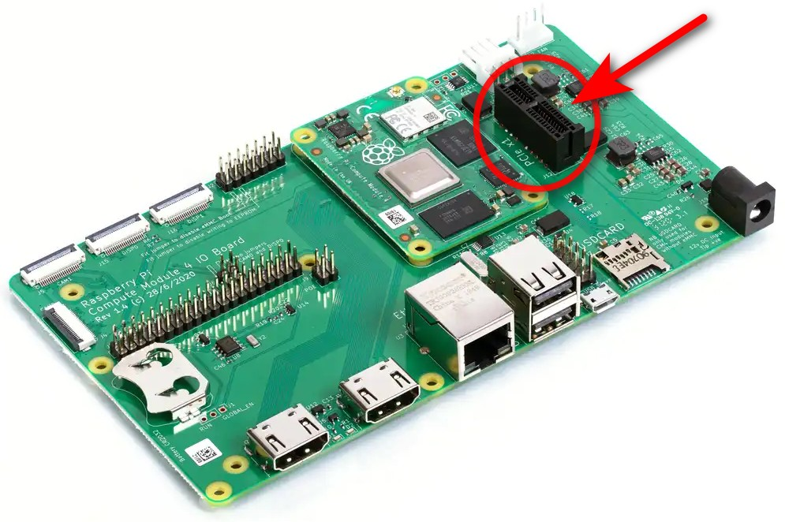
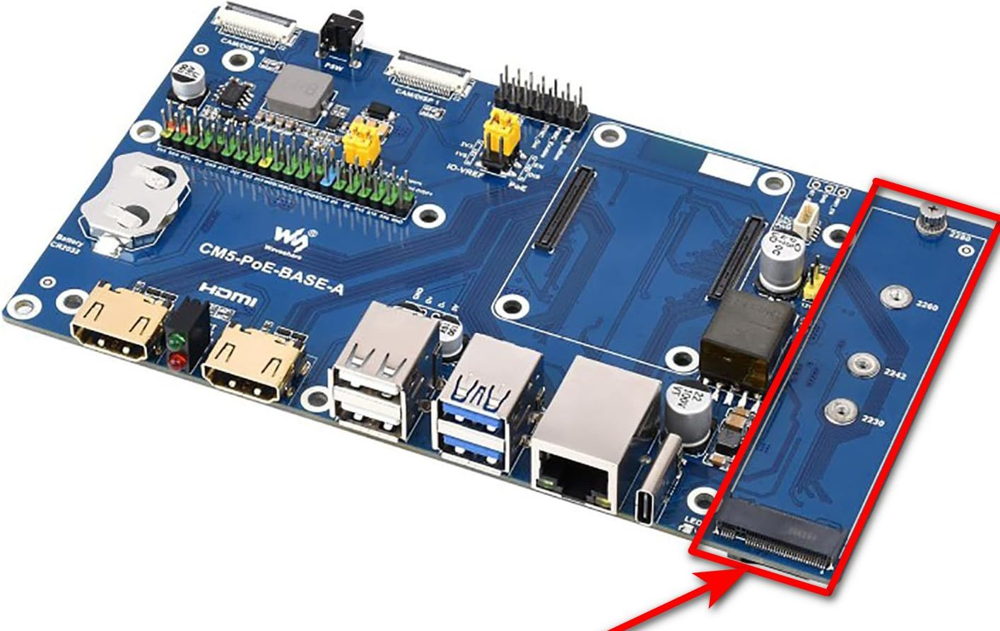
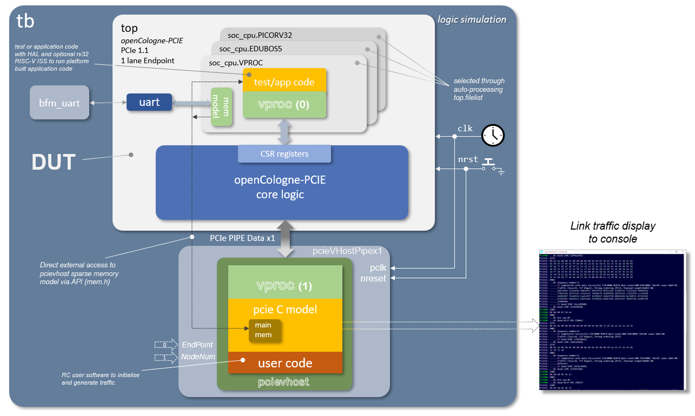
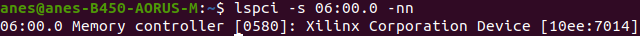
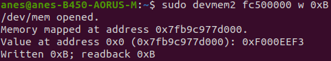
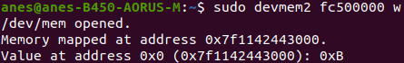

This project is the direct continuation of [openCologne](https://github.com/chili-chips-ba/openCologne), and it also firmly ties into [openPCIE](https://github.com/chili-chips-ba/openpcie).

  

The project aims to take _openCologne_ to a new level, not only by introducing the `soft PCIE EndPoint core` to the GateMate portfolio, but also by challenging and testing the new, fully opensource [nextPNR](https://github.com/YosysHQ/prjpeppercorn) flow.

It aims to complement _openPCIE RootComplex_ with a layered EndPoint that's portable to other FPGA families and even to [OpenROAD](https://github.com/The-OpenROAD-Project) ASICs, leaving only the PHY in the hard-macro (HM) domain. This is the only soft PCIE protocol stack that's in opensource at the moment.

This soft PCIE EP core comes with unique `HW/SW co-sim` and two `PCIE cards for GateMate`. The new boards can work with all three device variants: A1, A2, A4 and are plug-and-play compatible with the vast assortment of 3rd-party carriers, including our opensource [PCIE Backplane](https://github.com/chili-chips-ba/openPCIE/tree/main/1.pcb/openpci2-backplane). 

The project aims for integration with LiteX, by expanding the [LitePCIE](https://github.com/enjoy-digital/litepcie) portfolio, thus creating a basis for the complete, end-to-end, community maintained _openCompute_ PCIE ecosystem.

We must also note that this project is about creating a **minimal PCIE EP stack**. Its scope is therefore limited to a demonstration of the `PIO writes and reads` only. Other applications, such as DMA, are not our deliverable, but can later on be created on top of them.

Power states and transitions are also not supported.

While our commitment is to deliver the `Gen1` EP, the design will from the get-go support the Gen2 throughput. We intend to try to bring up the Gen2 on the best-effort bases, as a bonus. However, the procedures for automatic up and down training of the link speed will not be implemented.

We will `only support x1 (single-lane)` PCIE links. The procedure for adjusting the link width will therefore be omitted.

> GateMate die has only one SerDes anyway. While, in theory, the A2 could support the 2-lane PCIE, that would turn everything on its head and become a major project on its own... one that would require splitting the PCIE protocol stack vertically, for implementation across two dice. Moreover, as we expect to consume most of the A1 for the PCIE stack, the A2 and A4 come into play as the providers of the logic resources needed to implement the final user app.

--------------------
# PIPE

### References
- [Warp-pipe: PCIe network simulator](https://github.com/antmicro/warp-pipe)

The GateMate SerDes has thus far not been used in the PCIE context. It is reasonable to expect issues with physical layer, which may therefore falter for signal integrity, jitter, or some other reasons. Luckily, the project has teamed up with Cologne Chip developers, who will own the PHY layer up to and including the PIPE 👍.

The PHY and PIPE have a separate workspace, see `2.rtl.PHY`.

> By designing to PIPE (Physical Interface for PCI Express) architecture, we can clearly separate the generic (i.e. "logic" only) from the FPGA-specific RTL. This does not mean that all of our RTL is portable to other vendors, but rather that it's structured in a way that facilitates future ports. It is typically the code on the physical side of the PIPE interface that will need to be revisited. As that's only a subsection of the complete design, we will have thereby saved a good chunk of the porting effort.

## Future outlook

When we think about roadmap and our possible future growth paths, in addition to the aforementioned DMA and porting to other FPGA families and ASICs, we are also thinking of:

- enablement of hardware acceleration for AI, Video, and general DSP compute workloads
- bolting onto [ztachip](https://github.com/ztachip/ztachip), to then look into acceleration of the PC host Python
> This borrows from Xilinx PYNQ framework and Alveo platform, where programmable [DPUs](https://www.amd.com/en/products/adaptive-socs-and-fpgas/intellectual-property/dpu.html) are used for quick mapping of algorithms into acceleration hardware, avoiding the time-consuming process of RTL design and validation. Such a combination would then make for the first-ever opensource "DPU" co-processor, and also works hand-in-hand with M.2 card variant. After all, the M.2 NiteFury and SQRL Acorn CLE 215+ M.2 cards were made for acceleration of crypto mining
- possibly also tackling the SerDes HM building brick.

## References:

- **[PCIE Primer](https://drive.google.com/file/d/1CECftcznLwcKDADtjpHhW13-IBHTZVXx/view) by Simon Southwell**

- [liteFury PCIE EP](https://github.com/hdlguy/litefury_pcie)
- [Wavelet-lab PCIE EP](https://github.com/wavelet-lab/usdr-fpga/tree/main/lib/pci)
- [LitePCIE EP](https://github.com/enjoy-digital/litepcie)
- [ECP5-PCIE EP](https://github.com/ECP5-PCIe/ECP5-PCIe)
- [Yumewatari](https://github.com/whitequark/Yumewatari)
- [Alex's PCIE EP](https://github.com/alexforencich/verilog-pcie)
- [Alex's PCIE cocoTB](https://github.com/alexforencich/cocotbext-pcie)
- [Regymm's PCIE_7x EP](https://github.com/regymm/pcie_7x)
- [Anes' PCIE EP](https://github.com/chili-chips-ba/openPCIE/tree/main/2.rtl)
- [PCIE EP DMA - Wupper](https://gitlab.nikhef.nl/franss/wupper)

Note: "opensource" PCIE EP designs in the above references are not truly opensource. They all rely on vendor-proprietary PCIE HM, which is a black box, whose insides are invisible and inaccessible to the user, and also not portable to other FPGA families.

--------------------

# Project Status

- [x] Procure Test equipment, test fixtures, dev boards and accessories

- [ ] Create docs and diagrams that are easy to follow and comprehend
>- [ ] RTL DL and TL
>- [ ] PIPE
>- [ ] SW
>- [ ] TB, Sim, VIP

- [ ] Design, debug and manufacture two flavors of EP cards
> Given the high-speed nature of this design, we plan for two iterations:
>- [ ] Slot RevA
>- [ ] M.2  RevA
>- [ ] Slot RevB
>- [ ] M.2  RevB
 
- [ ] Develop opensource PHY with PIPE interface for GateMate SerDes
>- [ ] x1, Gen1
>- [ ] x1, Gen2 (best-effort, bonus if we do it)

- [ ] Develop opensource RTL for PCIE EP DataLink Layer with PIPE interface
- [ ] Develop opensource RTL for PCIE EP Transport Layer

- [ ] Create comprehensive co-sim testbench

- [ ] Develop opensource PCIE EP Demo / Example for the PIO access
> - [ ] Software driver and TestApp
> - [ ] Debug and bringup

- [ ] Implement it all in GateMate, pushing it through nextPNR and timing closure
> - [ ] Work with nextpnr/ProjectPeppercorn developers to identify and resolve issues

- [ ] Port to LiteX
> - [ ] Work with LiteX developers to resolve issues

- [ ] Present project challenges and achievements at (at least) two trade fairs or conference
>- [ ] FPGA Conference Europe
>- [ ] Electronica

--------------------
# PCB

#### References:
- [ULX4M-PCIe-IO](https://github.com/intergalaktik/ULX4M-PCIe-IO)
- [openPCIE Backplane](https://github.com/chili-chips-ba/openPCIE/tree/main/1.pcb)
- [NiteFury-and-LiteFury](https://github.com/RHSResearchLLC/NiteFury-and-LiteFury)
- [4-port M.2](https://github.com/will127534/CM4-Nvme-NAS)
- [AntMicro EMS Sim](https://antmicro.com/blog/2025/07/recent-improvements-to-antmicros-signal-integrity-simulation-flow)
- [openEMS](https://docs.openems.de)

The PCB part of the project shall deliver two cards: GateMate in the (i) PCIE "Slot" and (ii) M.2 form-factors

While the "Slot" variant could have been skipped by using one of the ready=made adapters, it is more practical and less expensive not to have an interposer. “Slot” is still the dominant PCIE form-factor for desktops and servers. The M.2 is typically found in the laptops.

Initially, we will use the existing [CM4 ULX4M](https://github.com/intergalaktik/ULX4M) with off-the-shelf I/O boards:

As our two new boards are becoming ready, we will gradually switch to openPCIE backplane which features:
- "Slots" on one side
- M.2s on the other
- RootComplex as a plug-in card, for interoperability testing with [RaspberryPi](https://www.raspberrypi.com) and Xilinx Artix-7 .
- on-board (soldered-down) PCIE Switch for interoperability testing of the most typical use-case, which is when RootPort is not directly connected to EndPoints

As the final step, we will test them within PC host, using both "Slot" and M.2 connectivity options.

 
For additional detail, please jump to [1.pcb/README.md](1.pcb/README.md)

--------------------

# RTL Architecture

#### References:

For additional detail, please jump to [2.rtl/README.md](2.rtl/README.md)

--------------------

# SW Architecture

#### References

- Using [bysybox (devmem)](0.doc/using-busybox-devmem-for-reg-access.txt) for register access
- [Yocto](https://www.yoctoproject.org) and [Buildroot](https://buildroot.org)
- [PCIE Utils](https://mj.ucw.cz/sw/pciutils)
- [Debug PCIE issues using 'lspci' and 'setpci'](https://adaptivesupport.amd.com/s/article/1148199?language=en_US)

The purpose of the "Test App" is to put all hardware and software elements of the system together, and to demonstrate how it works in a typical end-to-end use case. It will enumerate and configure the End Point, then perform the PIO write-read-validate transactions over PCIE, perhaps toggling some LEDs. It is envisioned as a getting-started example for how to build more complex PCIE applications.

For as much as we’d like to make it 100% baremetal, i.e. fully decoupled from an underlying OS, Linux comes with such a rich set of PCIE goodies that it might be hard to write it all from scratch. It is therefore still TDB whether we will go _baremetal_, _bare-Linux_ /* minimal, specifically built by us to fit project needs */, _busybox_, or some other clever way that alleviates standard Linux requirement for a hardware MMU. 

For additional detail, please jump to [3.sw/README.md](3.sw/README.md)

--------------------

# TB/Sim Architecture

#### References:
- [pcieVHost](https://github.com/wyvernSemi/pcievhost/blob/master/doc/pcieVHost.pdf)

## Simulation Test Bench

The [openpcue2-rc test bench](5.sim/README.md) aims to have a flexible approach to simulation which allows a common test environment to be used whilst selecting between alternative CPU components, one of which uses the [_VProc_ virtual processor](https://github.com/wyvernSemi/vproc) co-simulation element. This allows simulations to be fully HDL, with a RISC-V processor RTL implementation such as picoRV32, IBEX or EDUBOS5, or to co-simulate software using the virtual processor, with a significant speed up in simulation times. The test bench has the following features:

* A [_VProc_](https://github.com/wyvernSemi/vproc) virtual processor based [`soc_cpu.VPROC`](5.sim/models/README.md#soc-cpu-vproc) component
  * [Selectable](5.sim/README.md#auto-selection-of-soc_cpu-component) between this or an RTL softcore
  * Can run natively compiled test code
  * Can run the application compiled natively with the [auto-generated co-sim HAL](4.build/README.md#co-simulation-hal)
  * Can run RISC-V compiled code using the [rv32 RISC-V ISS model](5.sim/models/rv32/README.md)
* The [_pcieVHost VIP_](https://github.com/wyvernSemi/pcievhost) is used to drive the logic's PCIe link
* Uses a C [sparse memory model](https://github.com/wyvernSemi/mem_model)
  * An [HDL component](5.sim/models/cosim/README.md) instantiated in logic gives logic access to this memory
  * An API is provided to _VProc_ running code for direct access from the _pcieVHost_ software, which implements this sparse memory C model.

The figure below shows an oveview block diagram of the test bench HDL.

More details on the architecture and usage of the test bench can be found in the [README.md](5.sim/README.md) in the `5.sim` directory.

## Co-simulation HAL

The PCIE EP control and status register harware abstraction layer (HAL) software is [auto-generated](4.build/README.md#co-simulation-hal), as is the CSR RTL, using [`peakrdl`](https://peakrdl-cheader.readthedocs.io/en/latest/). For co-simulation purposes an additional layer is auto-generated from the same SystemRDL specification using [`systemrdl-compiler`](https://systemrdl-compiler.readthedocs.io/en/stable/) that accompanies the `peakrdl` tools. This produces two header files that define a common API to the application layer for both the RISC-V platform and the *VProc* based co-simulation verification environment. The details of the HAL generation can be found in the [README.md](./4.build/README.md#co-simulation-hal) in the `4.build/` directory.

More details of the test bench, the _pcievhost_ component and its usage can be found in the [5.sim/README.md](5.sim/README.md) file.
  

--------------------
# Build Workflow

See [4.build/README.md](4.build/README.md)

--------------------

# Debug, Bringup, Testing

After programming the FPGA with the generated bitstream, the system was tested in a real-world environment to verify its functionality. The verification process was conducted in three main stages.

### 1. Device Enumeration

The first and most fundamental test was to confirm that the host operating system could correctly detect and enumerate the FPGA as a PCIe device. This was successfully verified on both Windows and Linux.

*   On **Windows**, the device appeared in the Device Manager, confirming that the system recognized the new hardware.
*   On **Linux**, the `lspci` command was used to list all devices on the PCIe bus. The output clearly showed our card with the correct Vendor and Device IDs, classified as a "Memory controller".

<table align="center" width="100%">
  <tr>
    <td align="center" width="50%">
      <b>Device detected in Windows Device Manager</b> 
      
    </td>
    <td align="center" width="50%">
      <b>`lspci` output on Linux, identifying the device.</b> 
      
    </td>
  </tr>
</table>

### 2. Advanced Setup for Low-Level Testing: PCI Passthrough

While enumeration confirms device presence, directly testing read/write functionality required an isolated environment to prevent conflicts with the host OS. A Virtual Machine (VM) with **PCI Passthrough** was configured for this purpose.

This step was non-trivial due to a common hardware issue: **IOMMU grouping**. The standard Linux kernel grouped our FPGA card with other critical system devices (like USB and SATA controllers), making it unsafe to pass it through directly.

The solution involved a multi-step configuration of the host system:

**1. BIOS/UEFI Configuration**

The first step was to enable hardware virtualization support in the system's BIOS/UEFI:
*   **AMD-V (SVM - Secure Virtual Machine Mode):** This option enables the core CPU virtualization extensions necessary for KVM.
*   **IOMMU (Input-Output Memory Management Unit):** This is critical for securely isolating device memory. Enabling it is a prerequisite for VFIO and safe PCI passthrough.

**2. Host OS Kernel and Boot Configuration**

A standard Linux kernel was not sufficient due to the IOMMU grouping issue. To resolve this, the following steps were taken:
*   **Install XanMod Kernel:** A custom kernel, **XanMod**, was installed because it includes the necessary **ACS Override patch**. This patch forces the kernel to break up problematic IOMMU groups.
*   **Modify GRUB Boot Parameters:** The kernel's bootloader (GRUB) was configured to activate all required features on startup. The following parameters were added to the `GRUB_CMDLINE_LINUX_DEFAULT` line:
    *   `amd_iommu=on`: Explicitly enables the IOMMU on AMD systems.
    *   `pcie_acs_override=downstream,multifunction`: Activates the ACS patch to resolve the grouping problem.
    *   `vfio-pci.ids=10ee:7014`: This crucial parameter instructs the VFIO driver to automatically claim our Xilinx device (Vendor ID `10ee`, Device ID `7014`) at boot, effectively hiding it from the host OS.

**3. KVM Virtual Machine Setup**

With the host system properly prepared, the final step was to assign the device to a KVM virtual machine using `virt-manager`. Thanks to the correct VFIO configuration, the Xilinx card appeared as an available "PCI Host Device" and was successfully passed through.

This setup created a safe and controlled environment to perform direct, low-level memory operations on the FPGA without risking host system instability.

### 3. Functional Verification: Direct Memory Read/Write

With the FPGA passed through to the VM, the final test was to verify the end-to-end communication path. This was done using the `devmem2` utility to perform direct PIO (Programmed I/O) on the memory space mapped by the card's BAR0 register.

The process was simple and effective:
1.  The base physical address of BAR0 (e.g., `fc500000`) was identified using `lspci -v`.
2.  A test value (`0xB`) was **written** to this base address.
3.  The same address was immediately **read back**.

  <table width="100%">
    <tr>
      <td align="center" width="50%">
        <b>1. Writing a value (0xB) to the BAR0 address</b> 
        
      </td>
      <td align="center" width="50%">
        <b>2. Reading back the value from the same address</b> 
        
      </td>
    </tr>
  </table>

The successful readback of the value `0xB` confirms that the entire communication chain is functional: from the user-space application, through the OS kernel and PCIe fabric, to the FPGA's internal memory and back.

## PCIE Protocol Analyzer

#### References
- [PCIE Sniffing](https://ctf.re/pcie/experiment/linux/keysight/protocol-analyzer/2024/03/26/pcie-experiment-1)
- [Stark 75T Card](https://www.ebay.com/itm/396313189094?var=664969332633)
- [ngpscope](http://www.ngscopeclient.org/protocol-analysis)
- [PCI Leech](https://github.com/ufrisk/pcileech)
- [PCI Leech/ZDMA](https://github.com/ufrisk/pcileech-fpga/tree/master/ZDMA)
- [LiteX PCIE Screamer](https://github.com/enjoy-digital/pcie_screamer)
- [LiteX PCIE Analyzer](https://github.com/enjoy-digital/pcie_analyzer)
- [Wireshark PCIe Dissector](https://github.com/antmicro/wireshark-pcie-dissector)
- [PCIe Tool Hunt](https://scolton.blogspot.com/2023/05/pcie-deep-dive-part-1-tool-hunt.html)
- [An interesting PCIE tidbit: Peer-to-Peer communicaton](https://xilinx.github.io/XRT/master/html/p2p.html). Also see [this](https://xillybus.com/tutorials/pci-express-tlp-pcie-primer-tutorial-guide-1)
- [NetTLP - An invasive method for intercepting PCIE TLPs](https://haeena.dev/nettlp)

--------------------

# LiteX integration

See [6.litex/README.md](6.litex/README.md)

--------------------

### Acknowledgements

We are grateful to **NLnet Foundation** for their sponsorship of this development activity.

   
   

The **wyvernSemi**'s wisdom and contribution made a great deal of difference -- Thank you, we are honored to have you on the project.

 

### Community outreach

It is in a way more important that the community knows about such-and-such project or IP, than for the code to it exists in some obscure repo. Without awareness, which comes through presentations, postings, conferences, ..., the work that went into delivering the technical content is not fully accomplished.

We therefore plan on putting time and effort into community outreach, and so through multiple venues. One of them is the presence at industry fairs and conferences, such as:

- [Embedded World 2026, Nuremberg](https://www.embedded-world.de/en). This is a trade fair where CologneChip will host a booth! This trade show also features a conference track.

- [FPGA Conference, Munich](https://www.fpga-conference.eu). Cologne Chip is one of the sponsors and therefore get at least 2 presentation slots.

- [Electronica 2026, Munich](https://electronica.de/en). It is very likely that CologneChip will have a booth. There is also a conference track.

- [FPGA Developer Forum, CERN, Geneva](https://indico.cern.ch/event/1467417). Cologne Chip is a sponsor. They might get presentation slots 

We are fully open to consider additional venues -- Please reach out and send your ideas!

### Public posts:

[2025-08-25](https://www.linkedin.com/feed/update/urn:li:ugcPost:7362742908170473473?commentUrn=urn%3Ali%3Acomment%3A%28ugcPost%3A7362742908170473473%2C7363111076936232962%29&dashCommentUrn=urn%3Ali%3Afsd_comment%3A%287363111076936232962%2Curn%3Ali%3AugcPost%3A7362742908170473473%29)

--------------------
#### End of Document
